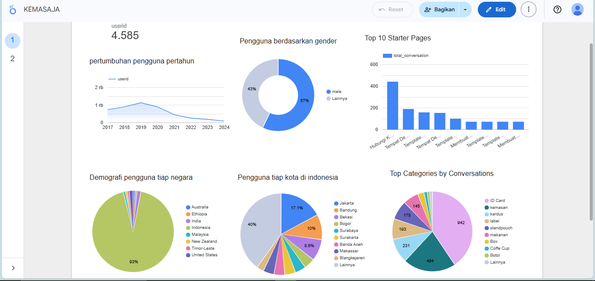

# Dashboard Analysis & Insights

Berdasarkan hasil visualisasi dashboard Looker Studio, diperoleh insight sebagai berikut:
## Dashboard Preview

---

## Total Pengguna Kemasaja

Total pengguna sampai dengan tahun 2024 adalah:

**4.585 pengguna**

Ini menunjukkan basis user yang cukup stabil dan sudah mencapai ribuan pengguna aktif.

---

## Pertumbuhan Pengguna per Tahun

- Pertumbuhan tertinggi terjadi sekitar tahun 2019.
- Setelah tahun 2020 terlihat tren penurunan pertumbuhan.
- Tahun 2022–2024 menunjukkan penambahan pengguna yang relatif lebih rendah dibandingkan periode awal.

Insight:
Kemungkinan terjadi penurunan acquisition rate setelah 2020. Perlu analisis lebih lanjut terkait strategi marketing atau retensi pengguna.

---

## Pengguna Berdasarkan Gender

- Male: 57%
- Lainnya: 43%

Insight:
Distribusi gender relatif seimbang, namun mayoritas pengguna adalah laki-laki.

---

## Demografi Pengguna per Negara

- 93% pengguna berasal dari Indonesia.
- Sisanya berasal dari:
  - Australia
  - Ethiopia
  - India
  - Malaysia
  - New Zealand
  - Timor-Leste
  - United States

Insight:
Market utama perusahaan ini sangat terfokus di Indonesia. Potensi ekspansi internasional masih terbuka.

---

## Pengguna per Kota di Indonesia

Distribusi terbesar berasal dari:

- Jakarta (~17%)
- Bandung (~10%)
- Bekasi (~8.6%)
- Kota lainnya tersebar dengan proporsi lebih kecil

Insight:
Konsentrasi pengguna berada di kota-kota besar. Strategi regional marketing bisa difokuskan di kota dengan pertumbuhan tinggi.

---

## Top Starter Pages

Halaman yang paling sering menjadi titik awal percakapan:

| Ranking | Page Title | Total Conversation |
|----------|------------|-------------------|
| 1 | Hubungi Kami Team Kemasaja | 440 |
| 2 | Tempat Desain Kemasan dan Cetak Kemasan Produk | 189 |
| 3 | Template Desain ID Card terbaik | 158 |
| 4 | Tempat Desain Kemasan dan Cetak Kemasan Produk | 153 |
| 5 | Template Desain ID Card terbaik | 100 |
| 6 | Membuat Desain Kemasan Makanan | 72 |
| 7 | Template Desain Kardus terbaik | 72 |
| 8 | Template Desain Label terbaik | 72 |
| 9 | Membuat Desain Kemasan Makanan | 72 |

Insight
- Halaman **Hubungi Kami** menjadi starter utama.
- Halaman desain kemasan dan template ID Card mendominasi.
- User datang dengan intent yang jelas, bukan sekadar browsing.

---

## Top Categories by Conversation

Distribusi kategori percakapan:

| Category | Total Conversation |
|-----------|------------------|
| ID Card | 942 |
| Kemasan | 494 |
| Kardus | 231 |
| Label | 193 |
| Standpouch | 178 |
| Makanan | 145 |
| Box, Coffee Cup, Botol | Proporsi kecil |

Insight
- **ID Card** adalah kategori tunggal terkuat.
- Jika kategori packaging digabung (Kemasan + Kardus + Label + Standpouch + Makanan), totalnya jauh lebih besar dari ID Card.
- Packaging merupakan kekuatan utama bisnis secara keseluruhan.

---

## Conversation Change vs Stay

- Stay: 99.2%
- Changed: 0.8%

Insight
- Mayoritas pengguna memulai dan mengakhiri percakapan pada kategori yang sama.
- Intent pengguna sangat jelas sejak awal.
- Funnel bersifat direct, minim eksplorasi lintas kategori.

Implikasi:
Bagus untuk conversion clarity, namun peluang cross-selling masih bisa ditingkatkan.

---

## Conversation Flow Between Pages

Pola alur percakapan menunjukkan:

- Product Page → Detail Page
- Product Page → Hubungi Kami
- Template → Versi Corporate / Lanjutan

### Insight Funnel
Alur utama:

Product Page → Detail → Contact

Menunjukkan bahwa pengguna:
1. Mengevaluasi produk
2. Memperdalam informasi
3. Siap melakukan komunikasi

Funnel ini sehat dan menunjukkan readiness to convert.

---

## Perubahan Minat Kategori (Before vs After Conversation)

Perubahan kategori sebelum dan sesudah percakapan menunjukkan fluktuasi kecil (±0.02–0.03).

Insight
- Tidak ada pergeseran minat signifikan.
- Minat pengguna stabil sepanjang percakapan.
- Percakapan memperdalam intent, bukan mengubah kategori minat.

---

## Category Conversation Share (%)

Distribusi persentase kategori:

- ID Card ~15%
- Kemasan ~8%
- Kardus ~4%
- Label ~3%
- Standpouch ~3%
- Makanan ~2–3%
- Kategori lainnya < 2%

Insight Strategis
1. ID Card adalah strongest single driver.
2. Packaging cluster adalah revenue backbone.
3. Kategori kecil (Coffee Cup, Botol) memiliki potensi untuk dikembangkan.

---

## Jumlah Pengguna Tahun 2022–2023

Diperoleh jumlah pengguna aktif dalam periode 2022–2023 berdasarkan filter `start_date`.

Insight:
Data ini dapat digunakan untuk menghitung growth rate tahunan dan retensi pengguna.

---

## Executive Summary

- Total pengguna: 4.585
- Pertumbuhan melambat setelah 2020.
- 93% pengguna berasal dari Indonesia.
- Conversation starter terbesar berasal dari halaman produk dan halaman kontak.
- 99% pengguna tidak berpindah kategori → intent sangat jelas.
- Funnel utama: Product → Detail → Contact.
- Packaging merupakan tulang punggung bisnis.

---

## Rekomendasi Strategis

1. Optimalkan halaman ID Card dan Kemasan dengan CTA yang lebih kuat.
2. Tambahkan fitur rekomendasi lintas kategori untuk meningkatkan cross-selling.
3. Evaluasi strategi acquisition pasca 2020.
4. Kembangkan kategori dengan share kecil sebagai peluang growth baru.
5. Perkuat halaman Hubungi Kami sebagai entry point utama percakapan.
---

# Dashboard Link

Dashboard dapat diakses di:

https://lookerstudio.google.com/reporting/d56f2951-e94d-4fdc-9578-df1112b17822

---

# End-to-End Data Workflow

Project ini mencerminkan alur kerja Data Analyst secara lengkap:

1. Raw data preprocessing (Python)
2. Data validation & cleansing
3. Import ke database (Supabase / PostgreSQL)
4. Query & aggregation
5. Dashboard visualization (Looker Studio)
6. Insight generation

---

# Portfolio Value

Project ini menunjukkan kemampuan:

- Data Cleaning & Preprocessing
- Data Validation & Type Enforcement
- SQL & Database Integration
- Analytical Thinking
- Dashboarding & Visualization
- Business Insight Interpretation

