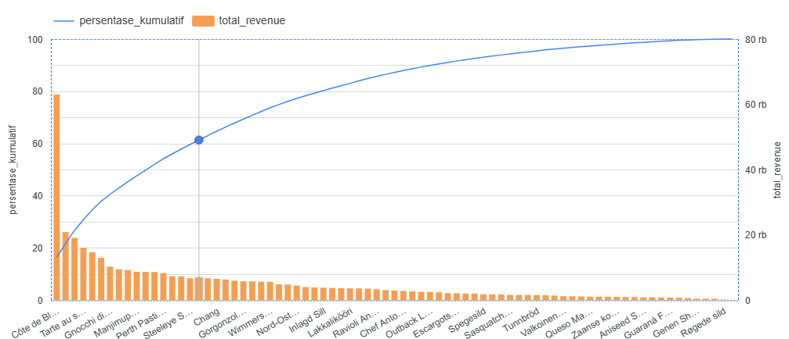
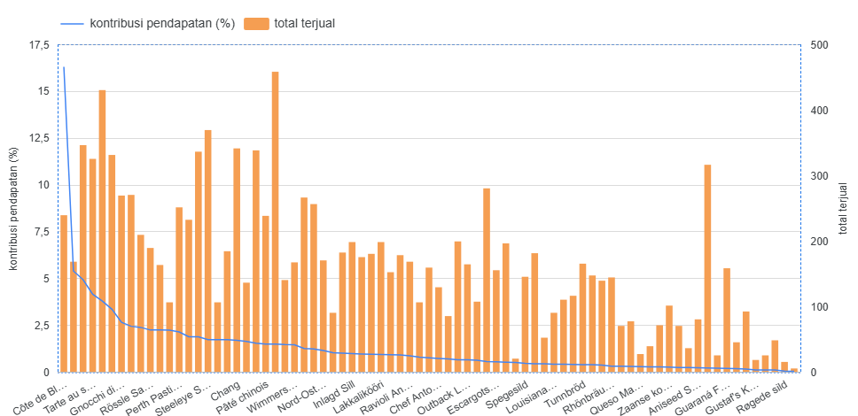
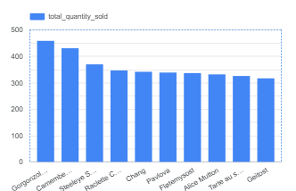
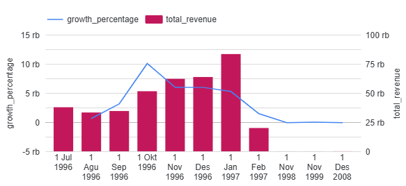

# Product Performance Analysis – Northwind Dataset

## Project Overview

Project ini bertujuan untuk menganalisis performa produk menggunakan dataset **Northwind**.  
Analisis difokuskan pada kontribusi revenue, volume penjualan, distribusi pendapatan, serta pertumbuhan revenue dari waktu ke waktu untuk mengidentifikasi produk yang menjadi penggerak utama bisnis perusahaan.

**Tools yang digunakan:**
- PostgreSQL (SQL Analysis)
- Looker Studio (Data Visualization)

---

## Business Objectives

1. Mengidentifikasi produk dengan kontribusi revenue terbesar.
2. Menganalisis distribusi revenue antar produk.
3. Mengukur kontribusi kumulatif produk terhadap total revenue perusahaan (Pareto Analysis).
4. Membandingkan volume penjualan dengan kontribusi revenue.
5. Menganalisis tren revenue dan growth rate bulanan.

---

## Dataset Structure

Dataset terdiri dari beberapa tabel utama:

- `orders`
- `orderdetails`
- `products`
- `customers`
- `suppliers`

Revenue dihitung menggunakan formula:

Revenue = quantity × price

---

# Analysis & Key Findings

---

## 1. Pareto Analysis (80/20 Rule)

Visualisasi: Persentase Kumulatif Revenue + Total Revenue per Produk

### Insight:

- Sebanyak **31 produk pertama menyumbang ≥80% dari total revenue perusahaan**.
- Titik kumulatif 80% tercapai pada produk *Inlagd Sill* dengan total revenue sebesar **3.762**.
- Hal ini menunjukkan bahwa revenue perusahaan terkonsentrasi pada sebagian kecil produk, sesuai dengan prinsip Pareto (80/20 rule).

### Business Interpretation:

Perusahaan sangat bergantung pada produk-produk tertentu sebagai revenue driver utama. Strategi pricing, promosi, dan ketersediaan stok untuk produk-produk tersebut menjadi krusial.

---

## 2. Sales Volume vs Revenue Contribution

Visualisasi: Total Terjual vs Persentase Kontribusi Revenue

### Insight:

- Produk dengan volume penjualan tinggi tidak selalu menjadi kontributor revenue terbesar.
- *Côte de Blaye* menyumbang **16,29% dari total revenue perusahaan**, meskipun bukan produk dengan quantity tertinggi.
- Beberapa produk terjual dalam jumlah besar tetapi memiliki kontribusi revenue yang relatif kecil.

### Business Interpretation:

Revenue sangat dipengaruhi oleh harga produk. Produk premium dengan harga tinggi dapat menghasilkan revenue besar meskipun volume penjualannya tidak dominan.

Implikasi strategis:
- Perusahaan perlu menjaga positioning produk premium.
- Produk dengan volume tinggi tetapi revenue rendah dapat dievaluasi kembali strategi pricing-nya.
- Analisis margin per produk dapat menjadi langkah lanjutan untuk optimasi profitabilitas.

---

## 3. Top 10 Products by Sales Volume

Visualisasi: Diagram Top 10 Produk Berdasarkan Quantity

Berikut adalah 10 produk dengan total quantity terjual tertinggi:

| product_id | product_name         | total_quantity_sold |
|------------|---------------------|--------------------|
| 31         | Gorgonzola Telino    | 458                |
| 60         | Camembert Pierrot    | 430                |
| 35         | Steeleye Stout       | 369                |
| 59         | Raclette Courdavault | 346                |
| 2          | Chang                | 341                |
| 16         | Pavlova              | 338                |
| 71         | Fløtemysost          | 336                |
| 17         | Alice Mutton         | 331                |
| 62         | Tarte au sucre       | 325                |
| 33         | Geitost              | 316                |

### Insight:

- **Gorgonzola Telino** menjadi produk dengan volume penjualan tertinggi (458 unit).
- Distribusi quantity antar produk relatif kompetitif.
- Produk dengan quantity tinggi tidak selalu masuk dalam daftar kontributor revenue terbesar.

Sebagai contoh, beberapa produk premium dengan quantity lebih rendah justru memberikan kontribusi revenue yang lebih besar dibanding produk dengan volume tinggi.

### Business Interpretation:

Hal ini menunjukkan adanya dua tipe strategi produk:

1. **Volume-driven products**  
   Produk dengan harga relatif lebih rendah tetapi memiliki tingkat penjualan tinggi.

2. **Margin-driven products**  
   Produk premium dengan harga tinggi dan kontribusi revenue besar meskipun volume lebih kecil.

Keseimbangan antara kedua tipe produk ini penting untuk menjaga stabilitas revenue dan arus kas perusahaan.

---

## 4. Monthly Revenue & Growth Analysis

Visualisasi: Total Revenue dan Growth Percentage per Bulan

### Insight:

- Revenue meningkat hingga akhir 1996 dan mencapai puncak pada awal 1997.
- Setelah periode tersebut terjadi penurunan revenue.
- Growth percentage mengikuti pola yang sama dan menunjukkan tren penurunan setelah puncak revenue.

### Business Interpretation:

Kemungkinan penyebab:
- Pola musiman (seasonality)
- Perubahan permintaan pasar
- Penurunan performa beberapa produk utama

Monitoring growth rate secara berkala penting untuk mendeteksi potensi fase decline lebih awal.

---

# Overall Business Insights

1. Revenue perusahaan sangat bergantung pada sebagian kecil produk utama.
2. Produk premium memberikan kontribusi revenue yang signifikan meskipun volume penjualannya tidak dominan.
3. High sales volume tidak selalu berarti high revenue.
4. Perusahaan mengalami fase pertumbuhan hingga awal 1997, diikuti tren penurunan.
5. Distribusi revenue menunjukkan adanya konsentrasi pada produk tertentu sehingga terdapat potensi revenue concentration risk.

---

# Dashboard Preview

(Tambahkan screenshot dashboard di sini)

Dashboard mencakup:

- Revenue Overview
- Pareto Contribution Analysis
- Product Sales vs Revenue Comparison
- Monthly Growth Trend
- Filter berdasarkan nama produk

---

# Technical Approach

Analisis dilakukan menggunakan:

- SQL Aggregation (SUM, GROUP BY)
- Window Functions (LAG, SUM OVER)
- Growth Rate Calculation
- Pareto Cumulative Percentage
- Interactive Visualization menggunakan Looker Studio

---

# Conclusion

Analisis menunjukkan bahwa performa perusahaan tidak merata di seluruh produk. Sebagian kecil produk menjadi kontributor utama revenue, sementara produk lainnya berperan sebagai pendukung volume penjualan.

Pendekatan berbasis data ini membantu perusahaan dalam:

- Menentukan prioritas produk
- Mengoptimalkan strategi pricing
- Mengidentifikasi potensi penurunan performa lebih awal
- Mengalokasikan sumber daya secara lebih efektif

---

